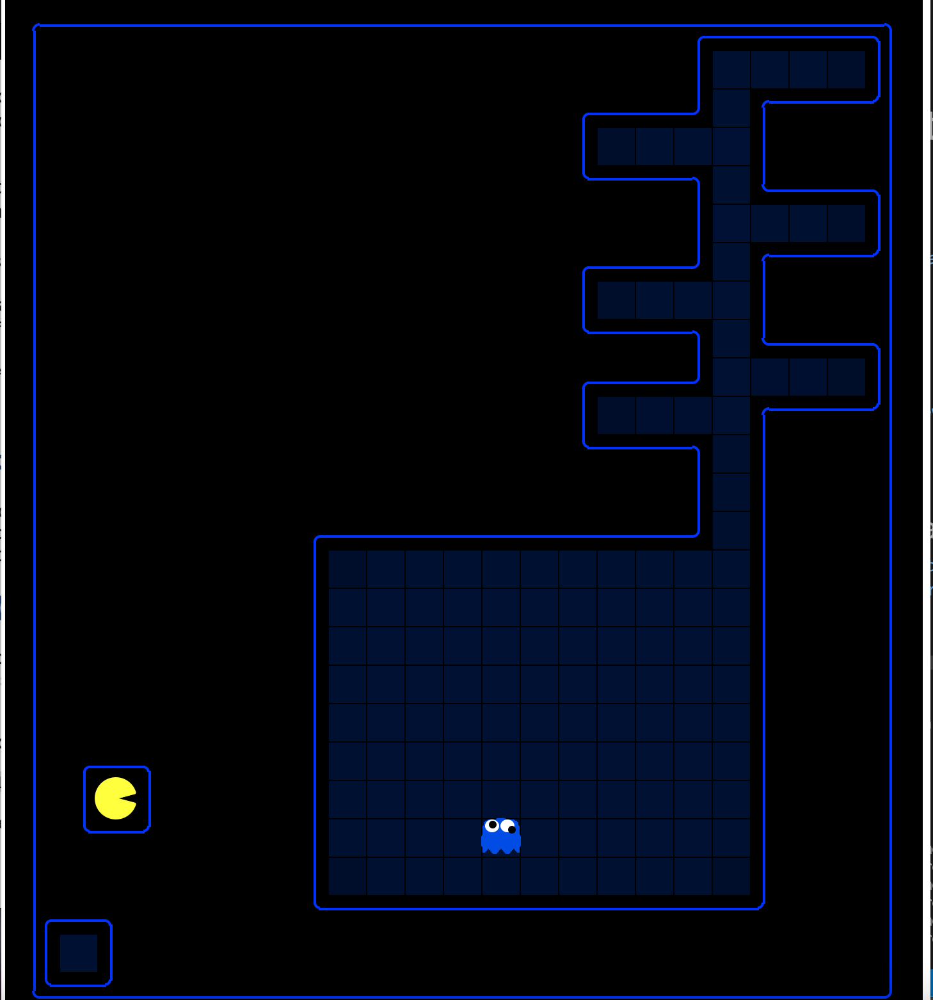
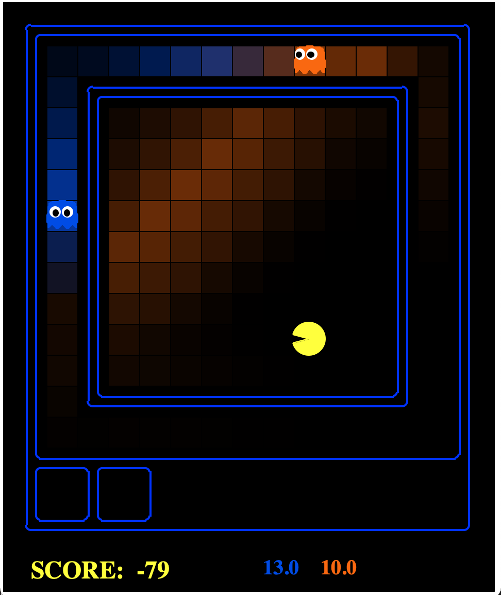
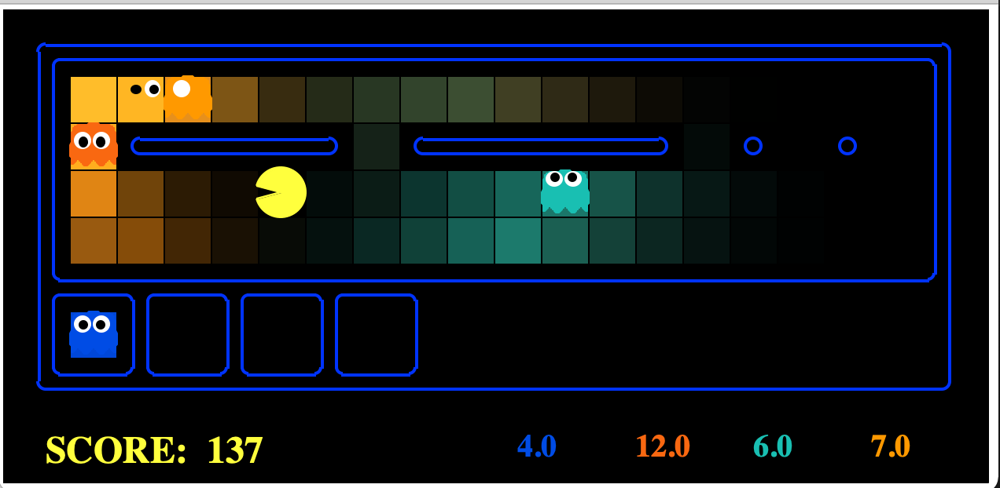
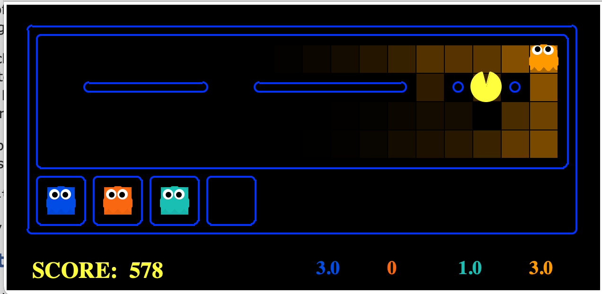

# Pacman-GUI

Pacman game with a mix of AI where we use sensors to locate and eat the invisble ghosts. Here we are assuming that our pacman is blind and is hunting ghosts and eating them.

Concepts used - Particle filters, Joint particle Filters, Dynamic Bayes nets

